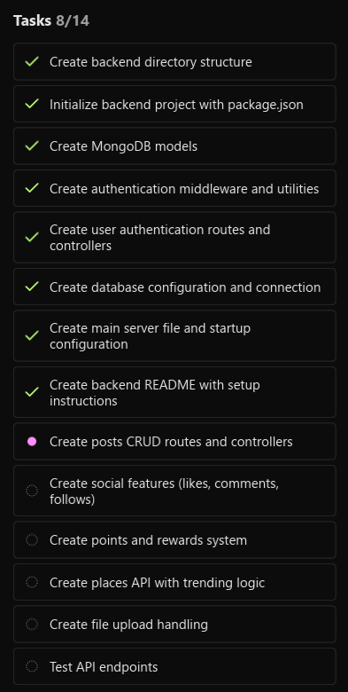

# Kerala Connect

[](https://reactnative.dev/)
[](https://www.typescriptlang.org/)
[](LICENSE)
[](https://github.com/Mohammad-Hassan027/Rastasetu)

A React Native tourism and social media platform where users can explore Kerala, share travel experiences, earn points, and redeem rewards.

## Features

### 🔐 Authentication
- User registration and login with JWT authentication
- Secure token storage and management
- Profile management

### 📱 Social Media Features
- Create posts with photos and location tags
- Like, comment, and share posts
- Follow/unfollow other users
- Interactive feed with pull-to-refresh
- User profiles with statistics

### 🗺️ Tourism & Exploration
- Explore trending tourist spots in Kerala
- Interactive map view with Google Maps integration
- Search and filter places by category
- Detailed place information with ratings and reviews

### 🎁 Points & Rewards System
- Earn points for app activity
- Redeem coupons and rewards
- Track points and redemption history
- Special offers for active users

## Screenshots & Demo

### App Preview
<div align="center">
  
</div>

> 📱 **Demo**: A live demo of the app will be available once deployed. Screenshots showcase the main interface and features.

### Key Screens
- **Home Feed**: Browse posts from fellow travelers
- **Explore**: Discover trending places in Kerala
- **Profile**: Manage your account and view statistics
- **Coupons**: Redeem rewards with earned points
- **Create Post**: Share your travel experiences

## Tech Stack

- **Frontend**: React Native with TypeScript
- **Navigation**: React Navigation v6
- **State Management**: React Hooks
- **HTTP Client**: Axios
- **Maps**: React Native Maps
- **Icons**: React Native Vector Icons
- **Image Picker**: React Native Image Picker
- **Storage**: AsyncStorage for local data persistence

## Project Structure

```
kerala-connect/
├── src/
│   ├── components/          # Reusable UI components
│   │   └── PostCard.tsx
│   ├── navigation/          # Navigation configuration
│   │   └── index.tsx
│   ├── screens/            # Screen components
│   │   ├── LoginScreen.tsx
│   │   ├── SignupScreen.tsx
│   │   ├── HomeScreen.tsx
│   │   ├── ExploreScreen.tsx
│   │   ├── ProfileScreen.tsx
│   │   ├── CouponsScreen.tsx
│   │   └── CreatePostScreen.tsx
│   ├── services/           # API and service layer
│   │   └── api.ts
│   ├── styles/             # Styling and theme
│   │   └── common.ts
│   ├── types/              # TypeScript type definitions
│   │   └── index.ts
│   └── utils/              # Utility functions
│       └── auth.ts
├── android/                # Android-specific files
├── ios/                    # iOS-specific files
├── App.tsx                 # Root component
├── index.js               # Entry point
├── package.json           # Dependencies
└── README.md              # This file
```

## Prerequisites

Before you begin, ensure you have the following installed:

- **Node.js** (v16 or higher)
- **React Native CLI**: `npm install -g react-native-cli`
- **Android Studio** (for Android development)
- **Xcode** (for iOS development - macOS only)

### Android Setup
1. Install Android Studio
2. Configure Android SDK
3. Set up Android emulator or connect physical device
4. Enable USB debugging on physical device

### iOS Setup (macOS only)
1. Install Xcode from Mac App Store
2. Install iOS simulator
3. Configure signing certificates

## Installation

> **⚠️ Important Note**: This project currently contains only the source code. You'll need to initialize the React Native project structure for Android and iOS platforms after cloning.

1. **Clone the repository**
   ```bash
   git clone https://github.com/Mohammad-Hassan027/Rastasetu.git
   cd Rastasetu/kerala-connect
   ```

2. **Initialize React Native project structure**
   ```bash
   # Initialize React Native project with proper structure
   npx react-native init KeralaConnectTemp --template react-native-template-typescript
   
   # Copy the generated android and ios folders to your project
   cp -r KeralaConnectTemp/android .
   cp -r KeralaConnectTemp/ios .
   
   # Clean up temporary project
   rm -rf KeralaConnectTemp
   ```

3. **Install dependencies**
   ```bash
   npm install
   ```

4. **Install iOS dependencies** (macOS only)
   ```bash
   cd ios && pod install && cd ..
   ```

5. **Configure environment variables**
   
   Create a `.env` file in the root directory:
   ```bash
   # API Configuration
   REACT_NATIVE_API_BASE_URL=https://your-backend-api.com/api
   
   # Google Maps API Key
   GOOGLE_MAPS_API_KEY=your_google_maps_api_key_here
   
   # Optional: Environment
   NODE_ENV=development
   ```
   
   **Important**: Never commit your `.env` file to version control. Add it to `.gitignore`.

6. **Update configuration files**
   - Update the `BASE_URL` in `src/services/api.ts` to use your environment variable
   - Configure Google Maps API key in platform-specific files

## Running the App

### Android
```bash
# Start Metro bundler
npm start

# In another terminal, run Android app
npm run android
```

### iOS (macOS only)
```bash
# Start Metro bundler
npm start

# In another terminal, run iOS app
npm run ios
```

## Backend Integration

The app is designed to work with a Node.js backend API. The app expects the following endpoints:

### Authentication
- `POST /api/auth/login` - User login
- `POST /api/auth/signup` - User registration
- `POST /api/auth/logout` - User logout

### User Management
- `GET /api/users/me` - Get current user profile
- `GET /api/users/:id` - Get user by ID
- `PUT /api/users/me` - Update user profile
- `POST /api/users/:id/follow` - Follow user
- `DELETE /api/users/:id/follow` - Unfollow user

### Posts
- `GET /api/posts/feed` - Get user feed
- `POST /api/posts` - Create new post
- `POST /api/posts/:id/like` - Like post
- `DELETE /api/posts/:id/like` - Unlike post
- `GET /api/posts/:id/comments` - Get post comments
- `POST /api/posts/:id/comments` - Add comment

### Places
- `GET /api/places` - Get places (with optional category/search filters)
- `GET /api/places/trending` - Get trending places
- `GET /api/places/:id` - Get place details

### Coupons & Rewards
- `GET /api/coupons` - Get available coupons
- `GET /api/coupons/my-coupons` - Get user's redeemed coupons
- `POST /api/coupons/:id/redeem` - Redeem coupon
- `GET /api/users/me/points` - Get user points

### File Upload
- `POST /api/upload` - Upload image files

## Configuration

### API Base URL
Update the base URL in `src/services/api.ts`:
```typescript
const BASE_URL = 'https://your-api-server.com/api';
```

### Maps Configuration
1. Get a Google Maps API key
2. Add to `android/app/src/main/AndroidManifest.xml`:
   ```xml
   <meta-data
     android:name="com.google.android.geo.API_KEY"
     android:value="YOUR_GOOGLE_MAPS_API_KEY" />
   ```
3. Add to `ios/KeralaConnect/Info.plist`:
   ```xml
   <key>GMSAPIKey</key>
   <string>YOUR_GOOGLE_MAPS_API_KEY</string>
   ```

## Features in Detail

### Authentication Flow
- JWT-based authentication with secure token storage
- Automatic token refresh and logout on expiry
- Persistent login state across app restarts

### Social Feed
- Infinite scroll with pagination
- Pull-to-refresh functionality
- Real-time like/comment updates
- Image carousel for multiple photos

### Place Discovery
- Interactive map with custom markers
- Category-based filtering
- Search functionality
- Detailed place cards with ratings

### Points System
- Points earned for various activities:
  - Creating posts
  - Getting likes/comments
  - Visiting new places
  - Daily app usage
- Coupon redemption with point deduction
- Point history and tracking

## Project Status & Roadmap

### Current Status: 🚧 In Development

This project is currently under active development. Here's what's been implemented and what's planned:

#### ✅ Completed Features
- Basic project structure with TypeScript
- Component architecture (PostCard, Screen components)
- Navigation system with React Navigation v6
- API service layer with Axios
- Authentication flow (Login/Signup screens)
- Social media screens (Home, Profile, Create Post)
- Tourism exploration (Explore screen)
- Rewards system (Coupons screen)
- Type definitions and utilities

#### 🚧 In Progress
- Backend API integration
- Google Maps integration for places
- Image upload functionality
- Points and rewards system logic
- User authentication with JWT

#### 🗓️ Planned Features
- Real-time notifications
- Offline support with local storage
- Advanced search and filtering
- Social sharing integration
- Admin dashboard for content management
- Multi-language support (Malayalam, English)
- Dark mode theme
- Analytics and user insights

### Contribution Status
This project is open for contributions! Check the [Contributing](#contributing) section for guidelines.

## Development

### Adding New Screens
1. Create screen component in `src/screens/`
2. Add navigation types to `src/types/index.ts`
3. Configure routes in `src/navigation/index.tsx`

### Adding New API Endpoints
1. Add method to `ApiService` class in `src/services/api.ts`
2. Add corresponding TypeScript types in `src/types/index.ts`

### Styling
- Use common styles from `src/styles/common.ts`
- Follow the established color scheme and spacing
- Maintain consistency across components

## Troubleshooting

### Common Issues

1. **Metro bundler issues**
   ```bash
   npm start -- --reset-cache
   ```

2. **Android build errors**
   ```bash
   cd android && ./gradlew clean && cd ..
   ```

3. **iOS build errors**
   ```bash
   cd ios && rm -rf build && cd ..
   ```

4. **Dependencies issues**
   ```bash
   rm -rf node_modules package-lock.json
   npm install
   ```

## Contributing

1. Fork the repository
2. Create a feature branch
3. Make your changes
4. Add tests if applicable
5. Submit a pull request

## License

This project is licensed under the MIT License.

## Contact & Support

For questions, support, or collaboration:

- **GitHub**: [@Mohammad-Hassan027](https://github.com/Mohammad-Hassan027)
- **Repository**: [Rastasetu](https://github.com/Mohammad-Hassan027/Rastasetu)
- **Issues**: [Report bugs or request features](https://github.com/Mohammad-Hassan027/Rastasetu/issues)

### Connect with the Community
- Star ⭐ the repository if you find it helpful
- Fork 🍴 and contribute to the project
- Share 📢 with fellow developers and travel enthusiasts

---

<div align="center">
  <h3>🌴 Kerala Connect - Discover Kerala, Connect with Travelers! 🌴</h3>
  <p>Built with ❤️ for Kerala tourism and travel community</p>
  
  [](https://github.com/Mohammad-Hassan027/Rastasetu/stargazers)
  [](https://github.com/Mohammad-Hassan027/Rastasetu/network/members)
</div>
